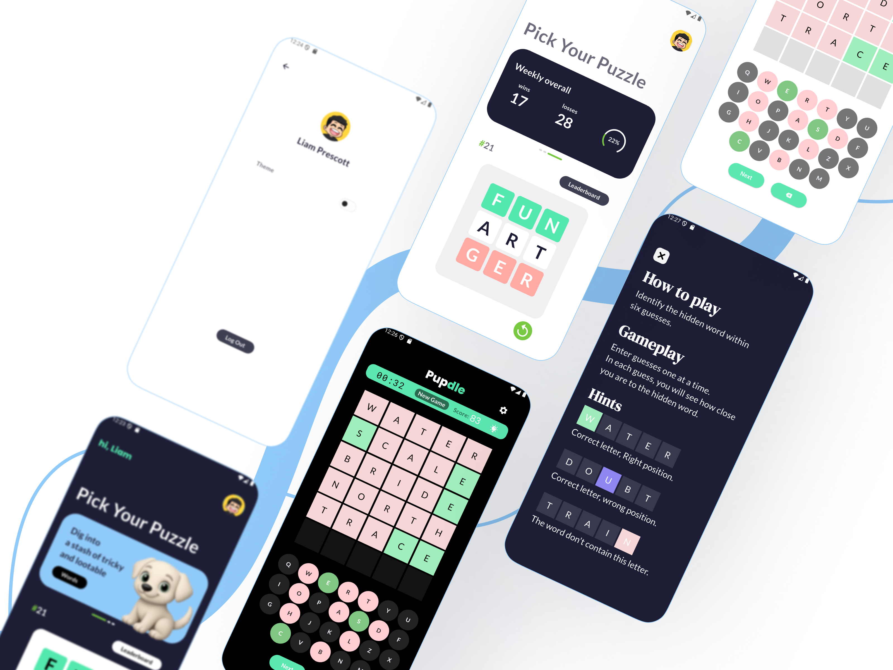

## Hi there 👋

# 💫 About Me:
Hi, I’m Yared — a Flutter developer passionate about building smooth mobile experiences.

## Current Active Project

  
  

## 🌐 Socials:
 

# 💻 Tech Stack:
                     
# 📊 GitHub Stats:
 
 

### 🔝 Top Contributed Repo

---

<!-- Proudly created with GPRM ( https://gprm.itsvg.in ) -->
